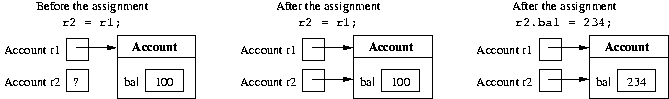
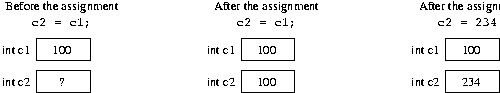

# 4단원: Java의 기본 데이터 유형

# 4.1 **수학의 데이터 유형(Data types in mathematics)**

### Java 프로그램에서 표현할 수 있는 데이터의 특성과 이러한 데이터를 조작하는 연산을 효과적으로 설명하기 위해 데이터 유형이라는 개념을 사용하겠습니다.

- Domain, 즉 가능한 값의 집합입니다. (예: 정수, 실수 등)
- 도메인 요소에 대한 일련의 연산.(예: 합, 곱셈 등)
- 수학 상수를 나타내는 *리터럴* 집합 입니다.(예: 23)

이러한 특성화를 통해 우리는 표현하려는 값과 이를 조작하는 작업을 정확한 방식으로 식별할 수 있습니다.

# 4.2 **Java의 기본 데이터 유형(Primitive data types in Java)**

숫자 정보를 처리하기 위해 Java는 **기본 숫자 데이터 유형** 이라고 하는 미리 정의된 6개의 데이터 유형을 사용합니다 . int , long , short , byte , float 및 double 이며 정수와 실수 를 표현할 수 있습니다.

Java는 숫자가 아닌 기본 데이터 유형 두 가지를 추가로 제공합니다 . char (영숫자 및 특수 기호를 나타냄) 및 boolean (참 값 true 및 false 을 나타냄 )입니다.

- 도메인 *(domain)* : 기본 데이터 유형을 통해 컴퓨터 메모리에 표시될 수 있는 가능한 값의 집합입니다(이 집합은 항상 유한하다는 점에 유의하세요).
- *연산* 집합 : 기본 데이터 유형의 값(예: + , - , / , * 등) 에 대해 기본 연산을 수행할 수 있게 해주는 프로그래밍 언어의 연산자입니다.
- *리터럴* 집합 : 기본 데이터 유형의 값을 정의하는 언어 기호(예: 10 , 3.14 , 'A' , true 등)

<aside>
💡 특정 데이터 유형의 값이 차지하는 메모리 크기를 지정하며 이는 숫자 데이터 유형에 중요합니다.

</aside>

## 4.3**데이터 유형 int (The data type int)**

| 유형 | 정수 |
| --- | --- |
| 치수 | 32비트(4바이트) |
| 도메인 | 간격 [- 2 31 , + 2 31 - 1] 내의 정수 집합.      (40억 개 이상의 값) |
| 연산 | + 합 |
|  | - 차이 |
|  | * 곱 |
|  | /   나누기 |
|  | % 나머지 |
| 리터럴 | 도메인 값을 나타내는 일련의 숫자(예: 275930) |

```
int a, b, c;// int형 변수 선언
a = 1;// 리터럴 사용
b = 2;
c = a + b;// 언어 연산자를 포함하는 산술 표현식
```

# 4.4 **기본 유형의 변수 및 객체에 대한 유형 참조의 변수**

(Variables of primitive types and variables of type reference to an object)

객체에 대한 유형 참조 변수와 기본 유형 변수 사이에는 상당한 차이가 있습니다.

- 객체에 대한 참조 유형의 변수 값은 **객체 자체**에 대한 참조가 아니라 **객체**에 대한 참조 입니다.
- 추가설명:
    1. **변수 선언**: 참조 변수를 선언할 때 해당 변수가 가리킬 수 있는 객체의 유형을 지정합니다. 예를 들어:
        
        ```java
        
        MyClass obj;
        
        ```
        
    2. **객체 생성**: 실제 객체를 생성하려면 **`new`** 키워드를 사용하여 메모리를 할당하고 객체를 초기화합니다:
        
        ```java
        
        obj = new MyClass(); // 이제 obj는 MyClass의 새 인스턴스를 가리킵니다
        
        ```
        
        ---
        
    
- 기본 유형의 변수 값은 **기본 유형 자체의 값** 입니다**(값이나 객체에 대한 참조가 아님).**

  Example:
• 객체에 대한 참조 유형의 변수 사용:

```java

public class Account {
public int bal;
public Account(int x) {
bal = x;
}
}
...
Account r1, r2;
r1 = new Account(100);
r2 = r1;
r2.bal = 234;
System.out.println(r1.bal); //  234를 인쇄
```

변수 r1 및 r2 에는 객체 가 아닌 **객체**에 대한 **참조**가 ****포함되어 있습니다 . r2 = r1 할당은 객체 자체가 아닌 **Account** 유형의 객체에 대한 참조를 r2 에 할당합니다 . r2 에서 참조되는 객체에 대한 각 연속 수정은 r1을 통해서도 표시됩니다 .



- 기본 유형의 변수 사용

```java
int c1, c2;
c1 = 100;
c2 = c1;
c2 = 234;
System.out.println(c1); // 인쇄=> 100
```

c2 = c1 할당은 c2 에 값 100을 할당합니다 . c2 의 연속적인 수정은 c1 에 영향을 주지 않습니다 .



# 4.5 **기본 유형의 변수를 수정하는 방법**

(Methods that modify variables of primitive types)

객체에 대한 유형 참조 매개변수가 아닌 기본 데이터 유형의 매개변수가 있는 경우 매개변수 전달에 비슷한 차이가 있습니다. 다음으로 객체에 대한 유형 참조 매개변수를 전달하면 호출 프로그램 단위에서 변수를 수정하는 메소드를 설계할 수 있다는 점을 살펴보겠습니다. 이는 기본 데이터 유형을 매개변수로 직접 전달하는 경우 불가능합니다.

- 추가설명:
    1. **원시 데이터 유형 매개변수**:
        
        원시 데이터 유형 (예: **`int`**, **`double`**, **`char`**)을 메소드의 매개변수로 전달할 때 실제 값의 복사본을 전달합니다. 메소드 내에서 이 복사본에 대한 변경은 호출 프로그램 단위의 원본 변수에 영향을 미치지 않습니다. 이는 원시 데이터 유형이 불변(immutable)하며 값의 복사본을 처리하기 때문입니다.
        
        예시:
        
        ```java
        
        public static void modifyPrimitive(int x) { x = x * 2; } public static voidmain(String[] args) { int num = 5; modifyPrimitive(num); System.out.println(num); // 출력: 5 (변화 없음) }
        
        ```
        
        이 예제에서 **`modifyPrimitive`** 메소드는 **`x`**의 값을 두 배로 만듭니다. 그러나 이는 **`main`** 메소드의 **`num`** 변수에 영향을 주지 않습니다.
        
    2. **객체 참조 유형 매개변수**:
        
        객체(사용자가 생성한 클래스의 인스턴스 포함)를 메소드의 매개변수로 전달하면 해당 객체에 대한 참조(reference)를 전달합니다. 메소드 내에서 객체의 상태를 변경하면 호출 프로그램 단위의 원본 객체에 영향을 미칩니다. 이는 동일한 기본 객체를 다루기 때문입니다.
        
        예시:
        
        ```java
        
        class MyClass { 
        int value; 
        MyClass(int value) { 
        this.value = value; 
        	} 
        } 
        public static void modifyObject(MyClass obj) {
         obj.value = obj.value * 2; 
        } 
        public static voidmain(String[] args) { 
        MyClass myObject = new MyClass(5); 
        modifyObject(myObject);
         System.out.println(myObject.value); // 출력: 10 (수정됨) 
        }
        
        ```
        
        이 예제에서 **`modifyObject`** 메소드는 **`myObject`** 인스턴스의 **`value`** 필드를 수정하고, 이 변경 사항이 **`main`** 메소드에서 반영됩니다.
        
    
    그러므로 객체 참조 유형의 매개변수를 전달할 때 호출 프로그램 단위의 변수를 수정할 수 있는 메소드를 설계할 수 있습니다. 이는 원시 데이터 유형을 직접 매개변수로 전달할 때는 불가능합니다. 왜냐하면 원시 데이터 유형의 경우 값의 복사본을 다루기 때문입니다.
    

*기본 유형의 변수를 수정하는 메서드(즉, 변수에 부작용이* 있는 메서드 )를 작성한다고 가정해 보겠습니다. 예를 들어 int 유형의 변수를 증가시키는 메서드를 구현하려고 합니다 .

```java
public static void increment(int p) {
p = p + 1;
}
```

이제 다음과 같이 증가 메소드를 호출하면 :

```java
public static void main(String[] args){
int a = 10;
increment(a);
System.out.println(a); // prints 10
}
```

예상했던 대로 프로그램이 11 대신 10 을 인쇄하는 것을 볼 수 있습니다. 이는 증분 메소드를 호출하는 동안 지역 변수 a 에 저장된 값 10이 형식 매개변수 p 에 *복사* 되기 때문입니다 . increment 메소드는 형식 매개변수 p 를 수정 하지만 지역 변수 a 의 내용은 수정하지 않습니다.

원하는 효과를 얻으려면 정수를 포함하는 객체에 대한 참조인 변수를 대신 전달할 수 있습니다.

```java
public static void increment(MyInteger x) {
x.a = x.a + 1;
}
```

여기서 정수를 감싸는 역할을 하는 MyInteger 클래스는 다음과 같이 간단히 정의할 수 있습니다.

```java

class MyInteger {
public int a;
}

```

이를 통해 프로그램을 다음과 같이 다시 작성할 수 있습니다.

```java

public static void main(String[] args){
MyInteger r = new MyInteger();
r.a = 10;
increment(r);
System.out.println(r.a); // prints 11
}
```

값 10은 r 이 참조하는 MyInteger 객체의 인스턴스 변수 a 에 저장됩니다 . 변수 r 에 저장된 참조는 메소드가 호출될 때 메소드 증분 의 형식 매개변수 x 에 복사됩니다. 따라서 x는 r이 참조 하는 동일한 객체를 참조하며 , 그러한 객체의 인스턴스 변수에 수행된 증가는 증가 메서드가 종료된 후에도 표시됩니다.

# 4.6 **기본 데이터 유형에 대한 래퍼 클래스**

(Wrapper classes for the primitive data types)

실제로 Java는 이미 기본 데이터 유형에 대한 소위 **래퍼(wrapper) 클래스를 제공합니다.** 각 기본 데이터 유형에는 일반적으로 데이터 유형과 이름이 동일하지만 대문자로 시작하는 연관된 클래스가 있습니다( 래퍼 클래스의 이름이 다른 int 및 char 제외).

| Primitive data type | Corresponding wrapper class |
| --- | --- |
| byte | 바이트 |
| short | 짧은 |
| int | 정수 |
| long | 긴 |
| Float | 뜨다 |
| double | 더블 |
| char | Character |
| boolean | 부울 |
- 이러한 클래스는 해당 기본 데이터 유형에 대한 작업(예: 문자열 간 변환)을 수행할 수 있는 특수 정적 메서드를 정의합니다.
- 게다가, 래퍼 클래스(wrapper classes)는 기본 데이터 유형의 값을 객체로 "래핑"하게 해줍니다. 이것이 바로 그들이 "래퍼 클래스"라고 불리는 이유입니다. 이미 매개변수 전달에서 이 측면의 유용성을 입증됬습니다.

---

## 4.7 **int 유형의 숫자 읽기**

(Reading of numbers of type int)

input 채널에서 여러 유형의 int를 읽으려면 다음을 사용합니다.

1. 입력 채널에서 문자열을 읽는 메소드(예: JOptionPane 클래스의 showInputDialog )
2. Integer 클래스의 정적 메소드인 parInt를 사용 하여 int 유형의 값으로 읽은 문자열에 해당하는 숫자를 얻습니다 .

*예:*

```java
String s = JOptionPane.showInputDialog("정수를 삽입하세요");
int i = Integer.parseInt(s);
```

또는

```java
int i = Integer.parseInt(
          JOptionPane.showInputDialog("정수를 삽입하세요."));
```

숫자와 다른 문자가 포함된 문자열에 대해 parseInt를 호출 하면 프로그램 실행 시 오류가 발생합니다.

## 4.8 **int 유형의 숫자 쓰기**

(Writing of numbers of type int)

다양한 int 유형을 작성하려면 print 또는 println 메소드를 직접 사용할 수 있습니다 .

*예:*

```java
int i = 1;
System.out.println(4);
System.out.println(i);
System.out.println(i + 4);
```

*참고:* + 기호는 두 숫자의 합과 두 문자열을 연결하는 데 모두 사용할 수 있습니다. "aaa" + "bbb" 는 "aaa".concat("bbb") 에 해당합니다 .

다음 두 명령문의 차이점에 유의하세요.

```java
System.out.println(3 + 4); // 7을 인쇄합니다(int로); +는 합계를 나타냅니다.
System.out.println("3" + 4); // 정수 4가 다음이므로 34(문자열)를 인쇄합니다.
                             // 먼저 문자열로 변환됩니다. +는 연결을 나타냅니다.
```

- 첫 번째 문장에서 "+"는 두 정수에 적용되므로 더하기 연산자를 나타냅니다.
- 따라서 println 의 인수3+4 는 int 유형입니다.
- 두 번째 명령문에서 ``+''는 문자열과 정수에 적용되므로 문자열 연결을 나타냅니다.
- 보다 정확하게는 정수4가먼저 문자열"4"로 변환된 다음 문자열"3"으로 연결됩니다 .
- 따라서 println 의 인수"3"+4는 String 유형입니다 .

println 메소드가 오버로드되었으므로 두 명령문 모두 정확합니다. Java 라이브러리에는 정수를 매개변수로 허용하는 버전과 문자열을 매개변수로 허용하는 버전이 모두 포함되어 있습니다.

 

## 4.9 **정수 표현식**

(Integer expressions)

다음 Java 프로그램 조각은 정수에 대한 연산자가 포함된 표현식을 보여줍니다.

```java
int a, b, c;
a = 10/3 + 10% 3;
b = 2 * -3 + 4;
c = 2 * (a + b);
```

연산자 사이의 다음 우선순위 규칙은 Java에서 유지됩니다(산술에서 사용되는 것과 동일함).

1. unary +, unary - (e.g., -x)
2. , /, %
3. +, -

대괄호를 사용하면 하위 표현식을 그룹화하는 방식을 변경할 수 있습니다. Java에서는 대괄호나 중괄호가 아닌 대괄호 ( 및 ) 만 하위 표현식을 그룹화하는 데 사용할 수 있습니다.

*예: Java에서* a+b*-c 표현식은 a+(b*(-c)) 와 동일합니다.

## 4.10 **숫자 오버플로**

(Numeric overflow)

기본 유형으로 표현될 수 있는 값 세트는 특정 간격으로 제한됩니다(예: int 유형의 경우 [-2 31 ,2 31 -1] ). 주어진 데이터 유형의 값에 산술 연산자를 적용하면 이 간격을 벗어나는 결과를 얻을 수 있으므로 동일한 기본 데이터 유형으로 표현할 수 없습니다. 이러한 상황을 **Overflow**라고 합니다 .

Example:
int x = 2147483647; //`int로 표현할 수 있는 최대값`
int y = x + 1; // `오버플로를 일으키는 연산, 결과는 다음과 같습니다.`
// `2147483648은 int로 표현할 수 없습니다.`

System.out.println(y); //`2147483648 대신 -2147483648을 인쇄합니다.`
// `(우리가 예상하는 숫자입니다)`

int 로 표시할 수 있는 가장 큰 숫자에 1을 더하면 오버플로가 발생하고 결과는 int로 표시할 수 있는 가장 작은 숫자가 됩니다 . 비공식적으로, 그것은 마치 우리가 표현 주위를 '순환'하는 것과 같습니다.

## 4.11 **결합 할당 연산자**

(Combined assignment operators)

Java 프로그램의 다음 부분을 고려하십시오.

```java
int sum, a, salary, increase;
sum = sum + a;
salary = salary * increase;
```

다음과 같이 축약될 수 있습니다.

```java
sum += a;
salary *= increase;
```

일반적으로 과제는 다음과 같습니다.

```java
x = x 연산자(operator) 표현식(expresstion)
```

다음과 같이 축약될 수 있습니다.

```java
x 연산자 = 표현식
```

각 산술 연산자 + , - , * , / , % 에 해당하는 결합 할당 연산자 += , -= , *= , /= , %= 가 있습니다 .

## 4.12 **증가 및 감소 연산자**

(Increment and decrement operators)

정수 변수 x 의 값을 1씩 증가시키려면 다음 세 가지 명령문 중 하나를 사용할 수 있습니다. 모두 동일합니다.

```java
x = x + 1;
x += 1;
x++;
```

*가장 간단한 형식은 후행 증가* 연산자++를 사용하는 형식입니다 .

마찬가지로 정수 변수를 1씩 감소시키려면 다음 세 가지 명령문 중 하나를 사용할 수 있습니다. 모두 동일합니다.

```java
x = x - 1;
x -= 1;
x--;
```

*이 경우에도 가장 간결한 형태는 후위 감소* 연산자를 사용하는 형태입니다

## 4.13 **부작용이 있는 표현식 및 명령문(선택 사항)**

(Expressions with side-effect and statements (optional))

Java는 표현식이라는 용어를 사용하여 *두* 가지 다른 개념을 나타냅니다.

- 산술 규칙에 따라 구성할 수 있는 int유형의 표현식과 같이 값 계산에만 효과가 있는 표현식입니다 .
- 값을 계산하는 것 외에도 할당(단순 또는 결합) 또는 증분과 같은 메모리 작업에 해당하는 표현식입니다. 우리는 이러한 *표현을 부작용이 있는 표현이라고*부릅니다 .
- 프로그램 상태(즉, 메모리)의 수정을 나타내기 위해 부작용이라는 용어를 사용한다는 점을 기억하세요. 이 유형의 표현식은 `` 로 끝나서 명령문으로 변환될 수 있습니다
    
    '', 그리고 이것이 바로 지금까지 변수에 값을 할당(또는 증가/감소)하기 위해 수행한 작업입니다. 부작용이 있는 표현식을 명령문으로 변환함으로써 연관된 값이 있는 표현식으로 간주하는 것을 포기합니다.
    

*예:*

- **`23*x+5`**는 수학 표현식입니다.
- **`x = 7`**은 Java에서 유효한 부작용(side-effect)이 있는 표현식이며, 해당 표현식의 값은 할당문의 오른쪽 값입니다. 이를 세미콜론(**`;`**)으로 끝내면 **`x = 7;`**이라는 문(statement)을 얻게 됩니다.
- **`y = x = 7`** 또한 유효한 Java 표현식으로, 두 개의 부작용을 가지고 있습니다. 첫 번째 부작용은 7을 x에 할당하고, 두 번째 부작용은 x = 7 표현식의 값(위에서 언급한 대로 7)을 y에 할당합니다.

Java에서는 두 가지 유형의 표현식을 제한 없이 사용할 수 있지만 *부작용이 있는 표현식은 명령문을 형성하는 데에만 사용* 하고 산술 표현식 내에서는 항상 사용하지 않습니다.

*예:* 문

> x = 5 * (y = 7);
> 

다음과 같이 다시 작성해야 합니다.

> y = 7;
x = 5 * y;
> 

*이러한 구별은 표현식이 함수 및 함수 적용의 수학적 개념에 대한 추상화* 인 반면, 부작용이 있는 표현식(문)은 할당 개념 , 즉 수정의 *개념에 대한 추상화* 라는 사실에 기인합니다. 프로그램의 메모리 위치.

## 4.14 **상수와 매직넘버의 정의**

(Definition of constants and magic numbers)

**매직 넘버는** 의미 에 대한 설명 없이 코드에 사용되는 숫자 리터럴입니다. 매직 넘버를 사용하면 프로그램 읽기가 어려워지고 유지 관리 및 업데이트가 더 어려워집니다.

```java
Example:
int salary = 20000 * workedhours;
// 무슨 의지인가 20000?
```

숫자 리터럴 대신 **상수** 라고 하는 기호 이름을 정의하고 이를 사용하는 것이 더 좋습니다 .

```java
// 상수 SALARY_PER_HOUR 정의
final int SALARY_PER_HOUR = 20000;
...
// 이제 SALARY_PER_HOUR가 무엇을 의미하는지 명확해졌습니다.
int salary = SALARY_PER_HOUR * workedhours;
```

SALARY_PER_HOUR 는 Java에서 프로그램 실행 중에 내용이 변경되지 않는 변수인 상수입니다 . 변수 선언에서 final 수정자를 사용하여 상수를 선언할 수 있습니다 . 이는 변수 값이 수정될 수 없음(즉, 상수로 유지됨)을 나타냅니다.

상수 사용의 주요 이점은 다음과 같습니다.

- *프로그램의 가독성:*
    
    중요한 이름을 가진 상수의 식별자는 매직 넘버보다 훨씬 읽기 쉽습니다(예:SALARY_PER_HOUR는 자체 설명이 가능하지만 20000은 그렇지 않습니다).
    
- *프로그램의 수정 가능성:*
    
    프로그램에 사용된 상수의 값을 수정하려면 상수의 정의를 변경하는 것으로 충분합니다(예:final int SALARY_PER_HOUR = 35000). 반면 매직 넘버를 사용하면 해당 값의 모든 항목을 수정해야 합니다. 프로그램에서 (예:20000con35000발생을 대체하여 ) 특정 매직 넘버의 어느 항목이 실제로 우리가 변경해야 하는 매직 넘버에 해당하는지 결정하는 것이 어려울 수 있습니다.
    

*참고:* 상수 선언( 최종 수정자를 포함)은 변수 선언과 동일한 방식으로 처리될 수 있습니다. 특히 선언이 메서드에 대해 로컬인 경우 상수의 범위는 메서드 자체입니다. 대신, 인스턴스 변수 선언에 final 수정자를 적용하면 상수는 생성되는 순간 각 객체에 연결되며, 객체마다 상수 값이 다를 수 있습니다.

## 4.15 **정수에 대한 기타 기본 데이터 유형: byte**

(Other primitive data types for integer numbers: byte)

| 유형 | byte |
| --- | --- |
| 치수 | 8비트(1바이트) |
| 도메인 | 간격 [−2^7, +2^7 − 1] = [−128, +127]내의 정수 집합.       |
| 연산 | + 합 |
|  | - 차이 |
|  | * 곱 |
|  | /   나누기 |
|  | % 나머지 |
| 리터럴 | 도메인 값을 나타내는 일련의 숫자(예: 47) |

```
byte a, b, c;// 바이트 유형의 변수 선언
a = 1;// 리터럴 사용
b = Byte.parseByte("47");// 문자열을 바이트로 변환
c = a - b;// 산술 표현식
```

## 4.16 **정수에 대한 기타 기본 데이터 유형: short**

(Other primitive data types for integer numbers: short)

| 유형 | short |
| --- | --- |
| 치수 | 16비트(2바이트) |
| 도메인 | 간격 [−2^15, +2^15 − 1] = [−32768, +32768]내의 정수 집합.       |
| 연산 | + 합 |
|  | - 차이 |
|  | * 곱 |
|  | /   나누기 |
|  | % 나머지 |
| 리터럴 | 도메인 값을 나타내는 일련의 숫자(예: 22700) |

```
short a, b, c;// short형 변수 선언
a = 11300;// 리터럴 사용
b = Short.parseShort("22605");// 문자열에서 짧은 형식으로 변환
c = b % a;// 산술 표현식
```

## 4.17 **수에 대한 기타 기본 데이터 유형: long**

(Other primitive data types for integer numbers: long)

| 유형 | long |
| --- | --- |
| 치수 | 64비트(8바이트) |
| 도메인 | 간격 [−2^63, +2^63 − 1] 내의 정수 집합.       |
| 연산 | + 합 |
|  | - 차이 |
|  | * 곱 |
|  | /   나누기 |
|  | % 나머지 |
| 리터럴 | 1(또는L)로 끝나는 일련의 숫자
도메인 값을 나타내는 일련의 숫자(예:9000000000L ) |

```
long a, b, c;// long형 변수 선언
a = 9000000000L;// 리터럴 사용
b = Long.parseLong("9000000000l");// String에서 Long으로 변환
c = b / 300000L
```

## 4.18 **실수의 기본 데이터 유형: double**

정수를 나타내는 유형 외에도 Java에는 실수를 나타내는 두 가지 기본 데이터 유형이 있습니다. 실수가 메모리 내부적으로 표현되는 방식으로 인해 이러한 숫자를 **부동 소수점 숫자** 라고도 합니다 .

Java 수학 라이브러리에서 기본적으로 사용되는 부동 소수점 숫자의 데이터 유형은 double 입니다 .


```
이중 파이, p2;// double형 변수 선언
파이 = 3.14;// 리터럴 사용
p2 = 628E-2d;// 리터럴 사용
p2 = 파이 * 2;// 산술 표현식
```

## 4.19 **실수의 기본 데이터 유형: float**

(Primitive data types for real numbers: float)


```
float pi, a, b;// float 유형의 변수 선언
pi = 3.14f;// 리터럴 사용
a = 314E-2F // 리터럴 사용
++;// 증분 연산자 사용(a = a + 1.0d;와 동일)
```

## 4.20 **double 또는 float 유형의 숫자 읽기**

(Reading of numbers of type double or float)

input 채널에서 여러 유형의 double (또는 float )을 읽으려면 다음을 사용합니다.

1. 입력 채널에서 문자열을 읽는 메소드(예: JOptionPane 클래스의 showInputDialog)
2. Double 클래스 (각각 Float)의 정적 메소드인 parDouble(각각, parseFloat )을 사용하여 double 유형 (각각 float ) 의 값으로 읽혀진 문자열에 해당하는 숫자를 얻습니다.

*예:*

```java
String s = JOptionPane.showInputDialog("숫자 삽입(예: 3.14)");
double i = Double.parseDouble(s);
```

또는

```java
double i = Double.parseDouble(
            JOptionPane.showInputDialog("숫자 삽입(예: 3.14)"));
```

## 4.21 **double 또는 float 유형의 숫자 쓰기**

(Writing of numbers of type double or float)

double 또는 float 유형을 작성하려면 print 또는 println 메소드를 직접 사용할 수 있습니다 .

*예:* The following code fragment

```java
double d = 98d;
System.out.println("d = " + d);
float x = 0.0032f;
System.out.println("x = " + x);
```

화면에 출력됩니다

```
d = 9.8E1
x = 3.2E-3
```

## 4.22 **연습: BankAccount 클래스**

(Exercise: the class BankAccount)

Specification:소유자의 이름과 성, 유로화 계좌 잔액을 특징으로 하는 은행 계좌를 처리하기 위한 클래스를 작성하세요. 은행 계좌 정보가 포함된 문자열을 얻기 위해 입금 및 출금 메소드 와 toString 메소드를 구현합니다.

사*용 예:*

```java
public class TestBankAccount {
public static void main (String[] args) {
BankAccount ba = new BankAccount("Mario", "Rossi");
System.out.println("Before the operations: " + ba);
ba.deposit(1000);
ba.withdraw(100);
System.out.println("After the operations: " + ba);
}
}
```

```java
//Answear 
public class BankAccount {
  private String name, surname;
  private double balance;

  public BankAccount(String n, String s) {
    name = n;  surname = s;  balance = 0;
  }

  public void deposit(double val) {
    balance = balance + val;
  }

  public void withdraw(double val) {
    balance = balance - val;
  }

  public String toString() {
    return "{ Owner: " + name + " " + surname +
      " - Balance: Euro " + balance + " }";
  }
}
```

## 4.23 **표현의 정밀도: 반올림 오류**

Precision in the representation: rounding errors

- 3.4028235 사이의 모든 숫자가 아닙니다.10+38및+3.4028235.10+38은 float로 표현될 수 있습니다 (double에 대해서도 비슷한 고려 사항이 적용됨 ).

이 측면은 아래 그림에 나와 있습니다. 0에 가까울수록 표시할 수 있는 숫자가 서로 더 가까워집니다(수직선으로 표시). 0에서 멀어질수록 표현할 수 있는 숫자는 서로 더 넓어집니다.


*예:* +3.4028235 에 가장 가까운 숫자입니다 . 10 +38 이고 float 로 표현될 수 있는 것은 +3.4028234 입니다 . 10 +38 .

이는 표현식 값을 계산할 때 반올림 오류로 인해 근사치가 발생합니다.

*예:*

```java
float x = 1222333444.0f;
System.out.println("x = " + x);
x += 1.0;
System.out.println("x+1 = " + x);
```

출력

```
x = 1.222333444E9;
x+1 = 1.222333444E9;
```

while

```java
정수 j = 1222333444;
System.out.println("j = " + j);
j += 1;
System.out.println("j+1 = " + j);
```

출력

```
j = 1222333444;
j+1 = 1222333445;
```

## 4.24 **측정의 정확성**

Precision in measures

연산 결과의 정밀도는 우리가 알고 있는 데이터의 정밀도에 따라 달라집니다.

*예:* 점 뒤의 소수점 이하 한 자리의 정밀도로 직사각형의 치수를 알고 있다고 가정합니다. 그러면 직사각형의 면적은 더 높은 정밀도를 가질 수 없으므로 소수점 두 번째 자리를 유효하게 간주하는 것은 의미가 없습니다.

9.2 * 5.3 = 48.76 (소수점 둘째자리는 유효하지 않음)

9.25 * 5.35 = 49.48 (여기 있습니다)

이는 프로그래밍 언어의 숫자 표현으로 인해 발생하는 것이 아니라 문제의 입력 값에 대한 지식이 제한되어 있기 때문에 발생합니다.

## 4.25 **수학 연산을 위해 사전 정의된 정적 메서드**

Predefined static methods for mathematical operations

숫자 유형의 값에 대한 수학 함수를 계산하기 위해 Java는 이러한 함수를 계산하는 데 사용할 수 있는 정적 메소드가 포함된 일부 클래스를 정의합니다. 예를 들어 미리 정의된 Math 클래스 에는 제곱근( sqrt ) 계산, 절대값 계산( abs ), 삼각 함수( sin , cos , tan ) 등을 계산하는 등 여러 메서드가 포함되어 있습니다.

다음 표는 Java API의 공식 문서에서 가져온 것입니다.

| 방법 요약 |  |
| --- | --- |
| static double | http://www.inf.unibz.it/~calvanese/teaching/java-docs/api/java/lang/Math.html#abs(double)(double a)          값 의 절대값을 반환합니다 double. |
| static float | http://www.inf.unibz.it/~calvanese/teaching/java-docs/api/java/lang/Math.html#abs(float)(float a)          값 의 절대값을 반환합니다 float. |
| static int | http://www.inf.unibz.it/~calvanese/teaching/java-docs/api/java/lang/Math.html#abs(int)(int a)          값 의 절대값을 반환합니다 int. |
| static long | http://www.inf.unibz.it/~calvanese/teaching/java-docs/api/java/lang/Math.html#abs(long)(long a)          값 의 절대값을 반환합니다 long. |
| static double | http://www.inf.unibz.it/~calvanese/teaching/java-docs/api/java/lang/Math.html#acos(double)(double a)0.0부터 pi           까지의 범위에 있는 각도의 아크코사인을 반환합니다 . |
| static double | http://www.inf.unibz.it/~calvanese/teaching/java-docs/api/java/lang/Math.html#asin(double)(double a)- pi /2부터 pi /2까지           의 범위에 있는 각도의 아크사인을 반환합니다 . |
| static double | http://www.inf.unibz.it/~calvanese/teaching/java-docs/api/java/lang/Math.html#atan(double)(double a)- pi /2부터 pi /2           까지의 범위에서 각도의 아크탄젠트를 반환합니다 . |
| static double | http://www.inf.unibz.it/~calvanese/teaching/java-docs/api/java/lang/Math.html#atan2(double,%20double)(double a, double b)          직각 좌표( b,  a)를 극좌표(r,  theta )로 변환합니다. |
| static double | http://www.inf.unibz.it/~calvanese/teaching/java-docs/api/java/lang/Math.html#ceil(double)(double a)double인수보다 작지 않고 수학적 정수와 동일한           가장 작은(음의 무한대에 가장 가까운) 값을 반환합니다 . |
| static double | http://www.inf.unibz.it/~calvanese/teaching/java-docs/api/java/lang/Math.html#cos(double)(double a)          각도의 삼각 코사인을 반환합니다. |
| static double | http://www.inf.unibz.it/~calvanese/teaching/java-docs/api/java/lang/Math.html#exp(double)(double a)값 을 거듭제곱           한 지수 edouble (예: 2.718...)를 반환합니다 . |
| static double | http://www.inf.unibz.it/~calvanese/teaching/java-docs/api/java/lang/Math.html#floor(double)(double a)double인수보다 크지 않고 수학적 정수와 동일한           가장 큰(양의 무한대에 가장 가까운) 값을 반환합니다 . |
| static double | http://www.inf.unibz.it/~calvanese/teaching/java-docs/api/java/lang/Math.html#IEEEremainder(double,%20double)(double f1, double f2)          IEEE 754 표준에 규정된 대로 두 인수에 대한 나머지 연산을 계산합니다. |
| static double | http://www.inf.unibz.it/~calvanese/teaching/java-docs/api/java/lang/Math.html#log(double)(double a)값 의           자연 로그(밑 edouble )를 반환합니다 . |
| static double | http://www.inf.unibz.it/~calvanese/teaching/java-docs/api/java/lang/Math.html#max(double,%20double)(double a, double b)          두 값 중 더 큰 값을 반환합니다 double. |
| static float | http://www.inf.unibz.it/~calvanese/teaching/java-docs/api/java/lang/Math.html#max(float,%20float)(float a, float b)          두 값 중 더 큰 값을 반환합니다 float. |
| static int | http://www.inf.unibz.it/~calvanese/teaching/java-docs/api/java/lang/Math.html#max(int,%20int)(int a, int b)          두 값 중 더 큰 값을 반환합니다 int. |
| static long | http://www.inf.unibz.it/~calvanese/teaching/java-docs/api/java/lang/Math.html#max(long,%20long)(long a, long b)          두 값 중 더 큰 값을 반환합니다 long. |
| static double | http://www.inf.unibz.it/~calvanese/teaching/java-docs/api/java/lang/Math.html#min(double,%20double)(double a, double b)          두 double값 중 더 작은 값을 반환합니다. |
| static float | http://www.inf.unibz.it/~calvanese/teaching/java-docs/api/java/lang/Math.html#min(float,%20float)(float a, float b)          두 float값 중 더 작은 값을 반환합니다. |
| static int | http://www.inf.unibz.it/~calvanese/teaching/java-docs/api/java/lang/Math.html#min(int,%20int)(int a, int b)          두 int값 중 더 작은 값을 반환합니다. |
| static long | http://www.inf.unibz.it/~calvanese/teaching/java-docs/api/java/lang/Math.html#min(long,%20long)(long a, long b)          두 long값 중 더 작은 값을 반환합니다. |
| static double | http://www.inf.unibz.it/~calvanese/teaching/java-docs/api/java/lang/Math.html#pow(double,%20double)(double a, double b)          두 번째 인수의 거듭제곱으로 거듭제곱된 첫 번째 인수의 값을 반환합니다. |
| static double | http://www.inf.unibz.it/~calvanese/teaching/java-docs/api/java/lang/Math.html#random()()보다 크거나 같고 보다 작은 double 양수 부호가 있는 값을           반환합니다 .0.01.0 |
| static double | http://www.inf.unibz.it/~calvanese/teaching/java-docs/api/java/lang/Math.html#rint(double)(double a)double값이 수학 정수에 가장 가깝고 a동일한 값을           반환합니다 . |
| static long | http://www.inf.unibz.it/~calvanese/teaching/java-docs/api/java/lang/Math.html#round(double)(double a)long인수에           가장 가까운 것을 반환합니다 . |
| static int | http://www.inf.unibz.it/~calvanese/teaching/java-docs/api/java/lang/Math.html#round(float)(float a)int인수에           가장 가까운 것을 반환합니다 . |
| static double | http://www.inf.unibz.it/~calvanese/teaching/java-docs/api/java/lang/Math.html#sin(double)(double a)          각도의 삼각 사인을 반환합니다. |
| static double | http://www.inf.unibz.it/~calvanese/teaching/java-docs/api/java/lang/Math.html#sqrt(double)(double a)          값 의 올바르게 반올림된 양수 제곱근을 반환합니다 double. |
| static double | http://www.inf.unibz.it/~calvanese/teaching/java-docs/api/java/lang/Math.html#tan(double)(double a)          각도의 삼각 탄젠트를 반환합니다. |
| static double | http://www.inf.unibz.it/~calvanese/teaching/java-docs/api/java/lang/Math.html#toDegrees(double)(double angrad)          라디안으로 측정된 각도를 도 단위로 측정된 해당 각도로 변환합니다. |
| static double | http://www.inf.unibz.it/~calvanese/teaching/java-docs/api/java/lang/Math.html#toRadians(double)(double angdeg)          도 단위로 측정된 각도를 라디안 단위로 측정된 해당 각도로 변환합니다. |

*예:*

> int j = -2;
System.out.println(Math.abs(j)); // 2를 인쇄합니다.
> 

## 4.26 **다양한 기본 숫자 유형을 포함하는 표현식**

(Expressions that involve different primitive numeric types)

다양한 데이터 유형의 값을 포함하는 표현식이 있는 경우 결과 유형은 다음 표에 따라 결정됩니다. 표는 a 및 b 에 대해 가능한 각 유형 쌍에 대해 a+b 형식의 표현식 결과 유형을 보여줍니다 .

| a+b | byte | short | int | long | float | double |
| --- | --- | --- | --- | --- | --- | --- |
| byte | int | int | int | long | float | double |
| short | int | int | int | long | float | double |
| int | int | int | int | long | float | double |
| long | long | long | long | long | float | double |
| float | float | float | float | float | float | double |
| double | double | double | double | double | double | double |

*예:*

> 
> 
> 
> int a; short b; implies that (a+b)// int 유형의 표현식임을   의미합니다 .
> int a; float b; implies that (a+b) //float 유형의 표현식임을   의미합니다 .
> float a; double b; implies that (a+b) //double 유형의 표현식임을   의미합니다 .
> 

이 표는 서로 다른 유형의 두 피연산자에 적용되는 산술 연산자로 구성된 산술 표현식의 유형에 대한 다음 규칙을 반영합니다.

- 한 피연산자의 유형이 다른 피연산자의 유형으로 표시되는 값의 하위 집합을 나타내는 경우 표현식의 유형은 값 집합이 더 큰 유형입니다.
- 한 피연산자가 정수 유형(byte,short,int,long)이고 다른 피연산자가 부동 소수점 유형(float,double)인 경우 결과는 부동 소수점 유형입니다.
- int보다 작은 기본 유형 (즉,byte또는 short)에 대해 산술 연산이 수행될 때마다 컴파일러는 연산을 실행하기 전에 유형 변환을 int 에 삽입합니다.따라서 결과는 최소한 int 유형이 됩니다 .

*참고:* int 보다 작은 유형의 변수에 작업 결과를 할당할 때마다 명시적인 유형 변환을 삽입해야 합니다(아래 참조).

## 4.27 **다양한 기본 숫자 유형 간의 할당**

Assignments between different primitive numeric types

정보가 손실될 위험이 있으므로 특정 유형의 값을 더 작은 크기의 데이터 유형 변수에 할당할 *수 없습니다 .* 또한 부동 소수점 값은 정수 변수에 할당될 수 없습니다.

다음 표에서는 a (행) 및 b (열) 에 대해 가능한 각 유형에 대해 a=b 할당이 적합한 지 여부를 설명합니다.

| a=b | byte | short | int | long | float | double |
| --- | --- | --- | --- | --- | --- | --- |
| byte | OK | ERROR | ERROR | ERROR | ERROR | ERROR |
| short | OK | OK | ERROR | ERROR | ERROR | ERROR |
| int | OK | OK | OK | ERROR | ERROR | ERROR |
| long | OK | OK | OK | OK | ERROR | ERROR |
| float | OK | OK | OK | OK | OK | ERROR |
| double | OK | OK | OK | OK | OK | OK |

*예:*

- int a; long b; a = b;
    
    Error: long유형의 값을 int 유형의 변수에 할당할 수 없습니다 .
    
- int a; float b; a = a + b;
    
    Error: a+b표현식은 float 유형이고 float 유형의 값은 int 유형의 변수에 할당될 수 없습니다 .
    

## 4.28 **명시적 유형 변환(캐스팅)**

Explicit type conversion (casting)

이**전 표의 잘못된 대입문을 컴파일하고 실행하려면 명시적인 유형 변환 (유형 캐스트** 라고도 함 ) 을 삽입해야 합니다.

Cast

---

*통사론:*

> ( type ) 표현
> 
- type*은*
    
    타입의 이름입니다.
    
- *표현식 은 유형이 강제로*
    
    *유형이 지정* 되는 표현식입니다.
    

*의미론:*

호환되지 않는 유형과 관련된 작업이 가능하도록 표현식의 유형을 다른 유형으로 변환합니다.

*예:*

> int a = (int) 3.75; // 표현식 3.75(double 유형)의 int로 캐스팅됩니다.
System.out.println(a); // 3을 인쇄합니다.
> 

캐스트를 수행할 때 결과는 **정밀도 손실** 로 인해 영향을 받을 수 있습니다 . 이전 예에서는 값 3.75 가 3 으로 **잘** 립니다 .

Example:

double d; float f; long l; int i; short s; byte b;
// `다음 할당은 정확합니다.`
d = f; f = l; l = i; i = s; s = b;
//`다음 할당은 올바르지 않습니다.`
f = d; l = f; i = l; s = i; b = s;
// `다음 할당은 정확합니다.`

//`하지만 결과는 정밀도 손실로 인해 영향을 받을 수 있습니다.`
f = (float)d; l = (long)f; i = (int)l; s = (short)i; b = (byte)s;

## 4.29 **기본 데이터 유형 char**

The primitive data type char

문자열은 char 유형의 값인 단일 문자로 구성됩니다 . char 유형의 변수에는 단일 문자만 포함될 수 있습니다. char 유형의 도메인은 유니코드 표준의 64000개 이상의 문자로 구성됩니다. 유니코드 표준은 다양한 언어(아시아 언어 포함)의 알파벳, 숫자 또는 특수 기호일 수 있는 숫자와 기호 간의 대응 관계를 설정합니다. 예를 들어 문자 'A'는 숫자 코드 65에 해당하고 문자 'B'는 숫자 코드 66에 해당합니다. 유니코드 표준에 대한 자세한 내용은 웹사이트 http://www.unicode 를 참조하세요 . 조직/ .

char 유형의 리터럴은 다양한 방법으로 표시될 수 있습니다. 가장 간단한 방법은 작은따옴표를 사용하는 것입니다.

*예:*

> char c = 'A'; String c = '0';
> 

## 4.30 **char 유형의 값을 포함하는 작업**

Operations that involve values of type char

- char 에서 int로의 변환은 문자의 유니코드 코드 계산에 해당합니다.
    
    > char c = 'A';
    int i = c; // 문자 'A'의 유니코드 코드가 포함되어 있습니다.
    System.out.println(i); // 65를 인쇄합니다.
    > 
- int에서 char로의 변환은 유니코드 코드에서 문자를 얻는 데 해당합니다.
    
    > int i = 65; // 문자 'A'의 유니코드 코드
    char c = (문자) i;
    System.out.println(c); // 'A'를 인쇄합니다.
    > 
- char 에서 String으로의 변환 :
    
    > char c = 'A';
    String s = String.valueOf(c);
    String s1 = Character.toString(c); // 이전 명령문과 동일합니다.
    > 
- String 유형의 객체에서 char추출 :
    
    > String s = "안녕하세요";
    char c = s.charAt(0); // "hello"에서 위치 0의 문자를 추출합니다.
                          // 즉, 'h'를 변수 c에 할당합니다.
    > 
- 문자 읽기 :
    
    > String s = JOptionPane.showInputDialog("문자를 삽입하세요");
    char c = s.charAt(0);
    > 
- 문자 쓰기:
    
    > char c = 'a';
    System.out.println(c);
    > 

## 4.31  **Boolean 대수: 도메인 및 연산자**

 Boolean algebra: domain and operators

Java에는 진리값을 나타내는 표현식(예: 값이 true 또는 false 일 수 있는 표현식 ) 을 처리할 수 있는 원시 데이터 유형 부울이 장착되어 있습니다.

**먼저 부울 대수학** 의 기본 개념을 기억해 보겠습니다 .


*:*

- **참과 거짓은 거짓** 이다
- **참 또는 거짓이 참** 이다
- **사실이 아닌 것은 거짓이다**
- **false 또는** ( **true 및** ( **false 아님 ))은false 또는** ( **true 및 true** ) 와 동일하며 이는 **false 또는 true와** 동일하며 이는 **true 와 동일합니다.**

## 4.32 **변수가 있는 Boolean 표현식: 진리표**

Boolean algebra: domain and operators

각 변수를 진리값으로 대체하고 연산자의 의미에 따라 단순화함으로써 변수가 있는 부울 표현식의 값을 얻을 수 있습니다. 부울 표현식의 의미를 특성화하기 위해 변수의 가능한 각 진리값 조합에 대해 전체 표현식의 진리값을 지정하는 테이블을 구성할 수 있습니다. 이러한 표를 **진리표** 라고 합니다 .

*부울 연산자의 진리표*


## 4.33 **기본 데이터 유형 Boolean**

The primitive data type boolean

| 유형 | Boolean |  |  |
| --- | --- | --- | --- |
| 치수 | 1bit |  |  |
| 도메인 | 두 가지 진리값 참 과 거짓 |  |  |
| 운영 | && | 그리고 | 참고: a && b 에서 b 값은 a가 참인 경우 에만 계산됩니다. |
|  | || | 또는 | 참고 : || b , b 값은 a 가 거짓 인 경우에만 계산됩니다. |
|  | ! | ~ 아니다 |  |
| 리터럴 | 참 과 거짓 |  |  |

*예:*

boolean a,b,c,d,e;
a = true;
b = false;

c = a && b; //`c = a와 b`
d = a || b; //  `d = a 또는 b`
e = !a; //`e = a가 아님`
System.out.println(e); // `부울 값을 나타내는 문자열을 인쇄합니다`
// `이 경우 "false"라는 문자열이 인쇄됩니다.`

## 4.34 Boolean**유형의 표현식**

Expressions of type boolean

다음은 boolean 유형의 간단한 표현식입니다 .

- 상수 true , false ;
- boolean 유형으로 선언된 *변수* ;
- 기본 데이터 유형에 적용되는 *비교 연산자 :*==,!=,>,<,>=,<=
- *조건자 (예:* boolean 유형의 값을 반환하는 메서드 )에 대한 호출.

부울 연산자를 사용하여 간단한 부울 표현식에서 복잡한 표현식을 구성할 수 있습니다 ! , && 및 || . 이러한 연산자의 경우 다음 우선순위가 적용됩니다.

1. !
2. &&
3. ||

*예: 다음은* boolean 유형의 올바른 표현식입니다 .

> || ! b&&c
> 

이는 다음과 같습니다:

> || ((! b) && c)
> 

## 4.35 **비교 연산자**

Comparison operators

기본 데이터 유형에 적용될 때 비교 연산자는 boolean 유형의 값을 반환합니다 .

| == | 같음( 주의 : = 는 == 와 다릅니다 ) |
| --- | --- |
| != | 와는 다르다 |
| > | ~보다 큰 |
| < | 미만 |
| >= | 보다 크거나 같음 |
| <= | 보다 작거나 같음 |

*예:*

| 10 < 20 | 다음과 같은 부울 표현식입니다. | 진실 |
| --- | --- | --- |
| 10 == 20 | 다음과 같은 부울 표현식입니다. | 거짓 |
| 10 != 20 | 다음과 같은 부울 표현식입니다. | 진실 |

*예:*

> 부울 x = 10 < 20; // 불리언 표현식의 값 할당
System.out.println(x); // "true"를 인쇄합니다.
> 

## 4.36 **부동 소수점 숫자 비교**

Comparing floating point numbers

부동 소수점 숫자에 대한 연산을 나타내거나 수행할 때 반올림 오류로 인해 이러한 숫자를 비교할 때 예상치 못한 결과가 발생할 수 있습니다.

*예:* 다음 코드 조각을 고려해보세요.

> 더블 r = Math.sqrt(2); // 2의 제곱근을 계산합니다.
더블 d = (r * r) - 2;
System.out.println(d); // 0 대신 4.440892098500626E-16을 인쇄합니다.
부울 b = (d == 0);
System.out.println(b); // false를 인쇄합니다(true를 기대합니다).
> 

따라서 *부동 소수점 숫자를 비교할* 때 다음 사항을 고려해야 합니다.

- 단순히==를사용하여 비교를 수행할 수는 없습니다.


## 4.37 **술어**

Predicates

boolean 유형의 값을 반환하는 메서드를 **조건** 자라고 합니다 .

*예:* 다음은 조건자인 정적 메서드의 정의입니다.

```java
public static boolean implies(boolean a, boolean b) {
return (!a || b); // not a or b
}
```

다음 코드 조각에 표시된 대로 사용할 수 있습니다.

```java
boolean x, y, z;
...
z = implies(x, y);
```

## 4.38 **다른 유형의 연산자 사이의 우선순위**

Precedence between operators of different types

다양한 유형의 연산자가 나타나는 복잡한 표현식을 평가해야 할 경우 다양한 우선 순위를 고려해야 합니다.

1. 논리적 부정(!) - 높은 우선순위
2. 산술 연산자
3. 관계 연산자
4. 논리적 연결(&&) 및 논리적 분리(||) - 낮은 우선순위

*예:*

> a+2 == 3*b || !trovato && c < a/3
> 
> 
> 둘은 같다.
> 
> ((a+2) == (3*b)) || ((!trovato) && (c < (a/3)))
> 

---

## Exercises

**연습 04.1** 메소드 작성:

> 공개 정적 이중 변환LireEuro(int x)이는 Lire로 금액 x가 주어지면 해당 금액을 유로로 반환합니다.
> 

**연습 04.2** 조건자 작성:

> 공개 정적 부울 sumOverflow(바이트 x, 바이트 y)
> 

x+y가 오버플로를 유발 하면 true를 반환하고 , 그렇지 않으면 false를 반환합니다 .

[힌트: 첫 번째 x 와 y를 short 유형의 두 변수에 할당하세요 . 그런 다음 두 개의 새 변수를 사용하여 합계 를 계산하고 합계 결과가 바이트에 들어갈 수 있는지, 즉 -128보다 크거나 같고 다음보다 작거나 같은지 확인하는 부울 유형의 표현식 결과 를 반환합니다. 127.

**연습 04.3** 키보드에서 정수 두 개를 읽고 화면에 인쇄하는 프로그램을 작성하세요.

- 산술 평균(즉, 합계를 2로 나눈 값)
- 기하 평균(곱의 제곱근)
- 두 숫자 중 더 큰 숫자와 더 작은 숫자입니다.

[힌트: Math클래스의 메서드를 사용하세요 . 예를 들어 제곱근을 계산하려면 Math.sqrt메서드를 사용하세요 .]

**연습 04.4** 헤더가 있는 조건자 작성

> public static boolean even(long x)
> 

숫자 *x* 가 짝수 이면true를 반환하고 그렇지 않으면 false를 반환합니다 .

[힌트: 나머지 정수 나눗셈에는 % 연산자를 사용 하고 boolean 유형의 표현식을 구성하려면 항등 연산자 ==를 사용하고 return 을 사용하여 해당 표현식의 결과를 반환합니다 .]

**연습 04.5** 오류 없이 컴파일되도록 다음 Java 프로그램 조각을 수정하세요. 변수의 유형을 변경하지 않고 수정해야 합니다.

> short x = 22;
byte y = x;
System.out.println(y);
> 

**연습 04.6** 다음 변수 선언을 고려해보세요:

> byte b;
short s;
int i;
long l;
float f;
double d;
char c;
boolean b1, b2;
> 

다음 각 표현에 대해 그 유형이 무엇인지 말해보세요.

1. b+10L
2. (b+i)*l
3. (b+i)*l+f
4. s/f + Math.sin(f)
5. c == '비'
6. l+1.5f
7. 나는<10
8. b1 == (f >= 5.0)
9. b1 && !b2
10. 

**연습 04.7** 연습 4.6의 변수 선언이 주어지면 다음 중 어떤 명령문이 컴파일러 오류를 일으키는지 말해보세요.

1. s = 65L;
2. f = i+100;
3. 나는 = 2*b + l;
4. b1 = s;
5. b2 = s >= 57;
6. c = b;
7. c = 'b';

**연습 04.8** 다음 프로그램이 실행되면 무엇을 출력하나요?

> public class Account {
public int bal;
public Account(int x) {
bal = x;
}
}
public class Exercise_4_8 {
public static void method(int a, Account b) {
a *= 2;
b.bal *= 2;
}
public static void main(String[] args) {
int c = 100;
Account r = new Account(100);
method(c,r);
System.out.println(c + " " + r.bal);
}
}
> 

**연습 04.9** 창고에 보관된 특정 제품의 상품에 대한 정보를 유지하려면 Product 클래스를 작성하세요 . Product 유형의 각 객체는 제품 이름(제품이 생성되는 순간 고정됨)과 창고에 저장된 제품 개수(초기 0)로 특징지어집니다. downLoad (저장된 조각 수 증가), upLoad (저장된 조각 수 감소) 및 toString 메소드를 구현 하여 제품에 대한 정보(예: "오키나와 램프, 25개" )를 반환합니다.

사용 예:

> public class TestProduct {
public static void main (String[] args) {
Product lamp = new Product("Lamp 60 Watt");
System.out.println("Before the loading: " + lamp);
lamp.downLoad(1000);
lamp.upLoad(100);
System.out.println("After the loading: " + lamp);
}
}
> 

**연습 04.10** 헤더가 있는 메소드 작성

> public static char lastCharacter(String s)
> 

매개변수로 전달된 문자열

s 의 마지막 문자를 반환합니다.